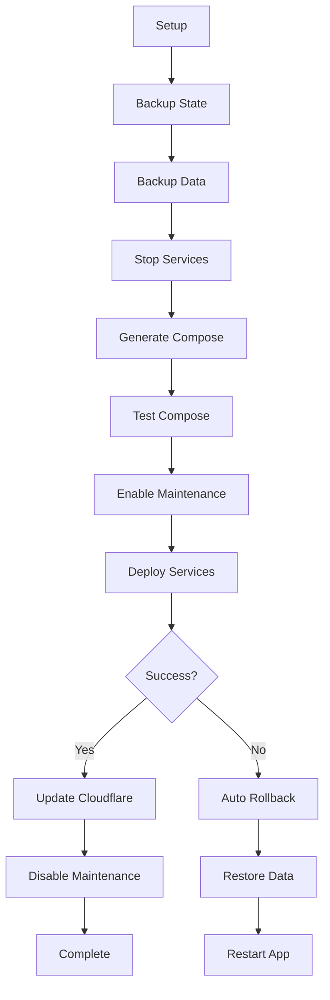

# Build Pipeline Quick Reference

## Deployment Process



## Quick Commands

### Trigger Deployment
```bash
# Automatic after Build Artifacts completes
# or manual via GitHub Actions UI
```

### Manual Rollback
```bash
# GitHub Actions > Rollback Deployment > Run workflow
# Specify environment and backup timestamp
```

### Check Backup Status
```bash
ssh truenas
ls -lh /mnt/Files/Apps/DJPanel/{Environment}/Images/backups/
```

### View Latest Backup
```bash
ssh truenas
ls -1t /mnt/Files/Apps/DJPanel/{Environment}/Images/backups/dj-panel-*-backup-*.yml | head -1
```

### Check App Status
```bash
ssh truenas
midclt call app.query '[["name","=","dj-panel-{env_slug}"]]' | jq '.[0].state'
```

### Manual Data Backup
```bash
ssh truenas
cd /tmp
# Upload backup-data-volumes.sh
chmod +x backup-data-volumes.sh
./backup-data-volumes.sh "Development" "development" "/mnt/Files/Apps/DJPanel/Development"
```

### Manual Data Restore
```bash
ssh truenas
cd /tmp
# Upload restore-data-volumes.sh
chmod +x restore-data-volumes.sh
./restore-data-volumes.sh "Development" "development" "/mnt/Files/Apps/DJPanel/Development" "20241226_120000"
```

## Backup File Locations

```
/mnt/Files/Apps/DJPanel/
├── Development/
│   └── Images/
│       └── backups/
│           ├── dj-panel-development-backup-{timestamp}.yml
│           └── data/
│               ├── development-mongodb_container_mongo_data-{timestamp}.tar.gz
│               ├── development-sqlserver_mssql_data-{timestamp}.tar.gz
│               ├── development-strapi_db_pg_data-{timestamp}.tar.gz
│               └── ... (other volumes)
└── Production/
    └── Images/
        └── backups/
            ├── dj-panel-production-backup-{timestamp}.yml
            └── data/
                └── ... (same structure)
```

## Health States

**Good States:**
- RUNNING
- ACTIVE
- DEPLOYED
- STARTED
- HEALTHY

**Bad States:**
- STOPPED (before deployment)
- FAILED
- ERROR
- CRASHED
- UNKNOWN

## Timeouts

- Service Stop: 3 minutes
- Deployment Health: 30 minutes
- Rollback Health: 10 minutes

## Emergency Procedures

### Force Stop Deployment
1. Cancel GitHub Actions workflow
2. SSH to TrueNAS
3. Manually stop app:
   ```bash
   midclt call app.stop "dj-panel-{env_slug}"
   ```

### Emergency Rollback
1. Trigger manual rollback
2. Select "latest" backup
3. Check "Skip health check"
4. Monitor progress

### Manual Service Start
```bash
midclt call app.start "dj-panel-{env_slug}"
```

### Manual Service Restart
```bash
midclt call app.restart "dj-panel-{env_slug}"
```

## Backup Information

### Data Volumes Backed Up

1. MongoDB
   - mongo_data
   - mongo_config
2. SQL Server
   - mssql_data
3. PostgreSQL (Strapi)
   - pg_data
4. Redis
   - redis_data
5. RabbitMQ
   - rabbitmq_data
6. Strapi App
   - strapi_app
7. Loki
   - loki_data
8. Prometheus
   - prometheus_data
9. Grafana
   - grafana_data

### Backup Retention
- Last 5 backups per volume type
- Last 5 compose file backups
- Automatic cleanup after each backup

## Monitoring

### Check Deployment Status
1. Go to GitHub Actions
2. Select "Build TrueNAS Infrastructure" workflow
3. View latest run
4. Check job statuses

### View Deployment Logs
1. Click on failed/running job
2. Expand job steps
3. Read logs

### Check TrueNAS Logs
```bash
ssh truenas
# View app logs
midclt call app.query '[["name","=","dj-panel-{env_slug}"]]' | jq '.[0]'

# View container logs
docker logs {container_name}
```

## Common Issues

### "No backup file found"
- First deployment - no previous state to backup
- This is expected and safe

### "Data backup failed"
- Deployment continues without data backup
- Check disk space on TrueNAS
- Verify volume paths exist

### "App failed to stop"
- Check for stuck containers
- May require manual intervention
- Use TrueNAS UI to force stop

### "Health check timeout"
- Deployment failed
- Automatic rollback triggered
- Review logs for root cause

### "Rollback failed"
- Manual intervention required
- Check backup files exist
- May need to restore manually

## Contact

For issues or questions:
1. Check GitHub Actions logs
2. Review this documentation
3. Contact system administrator
4. Escalate to development team if needed
